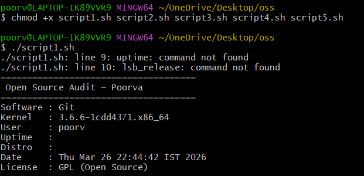
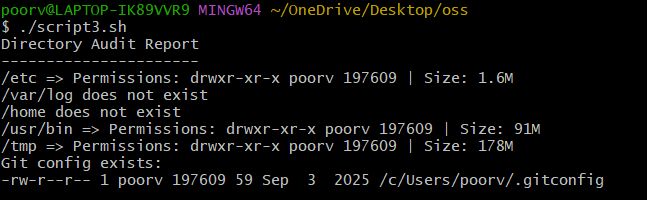
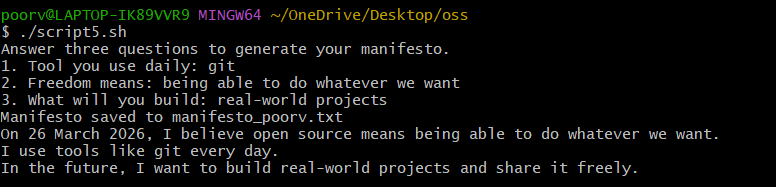

# The Open Source Audit  
### Course: Open Source Software (OSS NGMC)

---

## Student Details
- **Name:** Poorva Jaiswal 
- **Registration Number:** 24BCE11486  


## Project Overview
This project presents a structured audit of an open-source software system. It focuses on understanding the origin, philosophy, licensing, and technical working of the software along with practical implementation using shell scripting.


## Chosen Software
**Git (Distributed Version Control System)**

Git is an open-source version control system used to track changes in code and enable collaboration among developers.


## Objectives
- Understand open-source philosophy  
- Study licensing models  
- Analyze software in a Linux-like environment  
- Perform shell scripting tasks  
- Compare open-source vs proprietary software  


## Repository Structure
```text
├── script1.sh
├── script2.sh
├── script3.sh
├── script4.sh
├── script5.sh
│
├── README.md
└── report.pdf
```


## System Environment
- **OS:** Windows  
- **Terminal:** Git Bash  
- **Editor:** VS Code  
- **Version Control:** Git  

> Note: Git Bash was used as a Unix-like environment for executing shell scripts.


## Setup Instructions

### 🔹 Clone Repository
git clone https://github.com/Poorva77/open-source-audit.git

cd oss-audit


### 🔹 Give Execution Permission
chmod +x script1.sh script2.sh script3.sh script4.sh script5.sh


---

##  Running the Scripts

### Script 1: System Identity Report

./script1.sh




### Script 2: FOSS Package Inspector

./script2.sh


### Script 3: Disk and Permission Auditor

./script3.sh



### Script 4: Log File Analyzer

./script4.sh script1.sh echo


### Script 5: Manifesto Generator

./script5.sh



---

## Script Descriptions

### 🔹 Script 1 — System Identity Report
Displays system details such as user, kernel version, and date.


### 🔹 Script 2 — FOSS Package Inspector
Checks if Git is installed and displays version information.


### 🔹 Script 3 — Disk and Permission Auditor
Analyzes directory permissions and disk usage.


### 🔹 Script 4 — Log File Analyzer
Counts occurrences of a keyword in a file.


### 🔹 Script 5 — Manifesto Generator
Generates a personalized open-source philosophy statement.


## Dependencies
- bash  
- git  
- grep  
- awk  
- cut  


## Concepts Used
- Variables  
- Conditional statements  
- Loops  
- File handling  
- Command-line tools  


## Academic Integrity
This project has been implemented and tested independently. All concepts are understood and applied practically.


## Submission Checklist
-  GitHub Repository  
-  README.md  
-  5 Shell Scripts  
-  Project Report PDF  


## Final Note
This project demonstrates both the technical and philosophical aspects of open-source software and its importance in modern computing.

