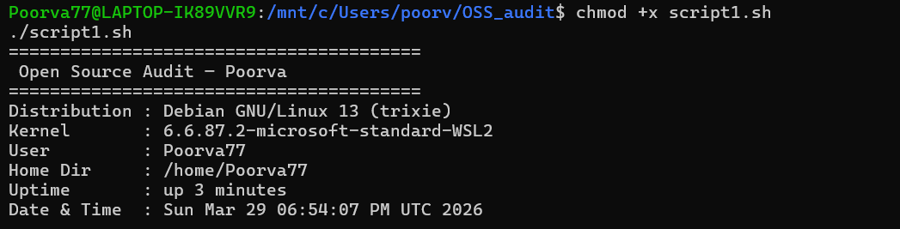
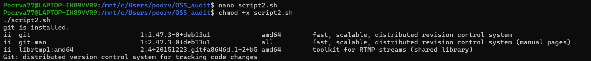
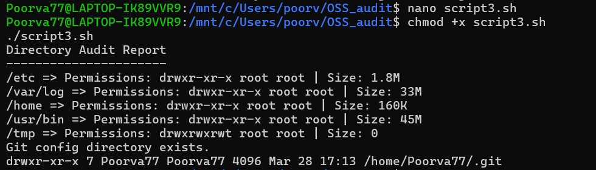
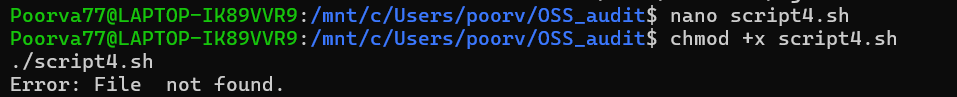
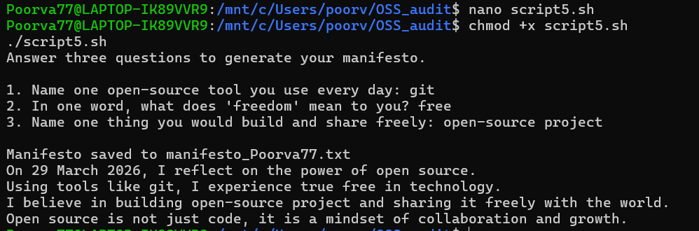

# Open Source Software Audit — Git  

A structured audit project exploring Git, one of the most widely used open-source version control systems.

---

## Student Details

| Field | Details |
|------|--------|
| Name | Poorva Jaiswal |
| Registration Number | 24BCE11486 |
| Course | Open Source Software |
| Project | Open Source Audit |

---

## Chosen Software - "Git"  

Git is a free and open-source distributed version control system developed by Linus Torvalds in 2005.  

It allows developers to:
- Track changes in source code  
- Collaborate efficiently across teams  
- Maintain complete version history  
- Manage branches and merges effectively  

---

## Repository Structure
```text
oss-audit-24bce11486/
├── README.md
├── outputs/
    ├── script1.png
    ├── script2.png
    ├── script3.png
    ├── script4.png
    ├── script5.png
├── script1.sh
├── script2.sh
├── script3.sh
├── script4.sh
├── script5.sh
└── report.pdf
```

---

## Script Descriptions  

### Script 1 — System Identity Report  
Displays a summary of the Linux environment including distribution name, kernel version, user, uptime, and date.



### Script 2 — FOSS Package Inspector  
Checks whether Git is installed and displays package details such as version and basic information.


### Script 3 — Disk and Permission Auditor  
Analyzes important system directories and reports their size, ownership, and permissions.



### Script 4 — Log File Analyzer  
Reads a log file, counts occurrences of a keyword, and displays a summary with recent matches.  



**Usage:**

./script4.sh /var/log/syslog error


### Script 5 — Open Source Manifesto Generator  
Takes user input and generates a personalized open-source statement saved to a text file.


---

## Dependencies  

- Linux (WSL Debian)  
- bash  
- git  
- grep, awk, cut  
- df, du  

To install Git:

sudo apt update
sudo apt install git


---

## How to Run  

### Clone Repository

git clone https://github.com/Poorva77/oss-audit-24bce11486.git

cd oss-audit-24bce11486


### Give Execute Permissions

chmod +x *.sh


### Run Scripts

./script1.sh
./script2.sh
./script3.sh
./script4.sh /var/log/syslog error
./script5.sh


---

## Concepts Used  
- Variables and command substitution  
- Conditional statements (if-else, case)  
- Loops (for, while)  
- File handling  
- Linux command-line tools  

---

## Academic Integrity  
This project has been implemented and tested independently. All scripts reflect practical understanding of shell scripting and open-source concepts.


## Author  
Poorva Jaiswal  
Open Source Software — VIT Bhopal University  

---